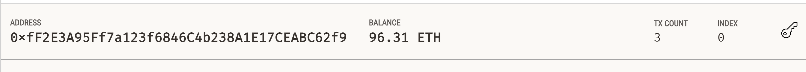
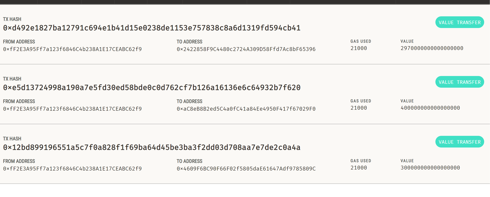
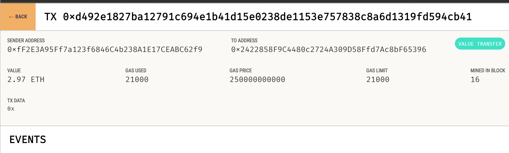

# Fintech Finder: Empowering Instant Cryptocurrency Payments for Fintech Professionals

In today's fast-paced world of fintech, finding and hiring the right professionals is crucial. Fintech Finder offers an innovative solution to seamlessly connect fintech professionals with employers. 

In this project, we integrate the Ethereum blockchain network into Fintech Finder. Our goal is to enable instant cryptocurrency payments for fintech professionals, ensuring they get compensated promptly for their valuable services.

---

## Technologies

The technologies used in this project include:

   * [Streamlit](https://streamlit.io/) 1.23.1: Streamlit is an open-source Python library used to create web applications for data science and machine learning projects.

   * [Python](https://www.python.org/) 3.7: Python is a versatile and widely-used programming language. It's the primary language for implementing the blockchain ledger and managing the logic of the application.

   * [Pandas](https://pandas.pydata.org/) 1.3.5: Pandas is a powerful data manipulation and analysis library for Python.

   * [Web3](https://web3py.readthedocs.io/en/stable/overview.html): Web3 is a Python library used for interacting with Ethereum, which is essential for blockchain-related operations.

   * [Eth-Tester](https://pypi.org/project/ethereum-tester/0.1.0a4/): Eth-Tester is a tool for testing Ethereum smart contracts, helping ensure the reliability of your blockchain-based applications.

   * [Mnemonic](https://pypi.org/project/mnemonic/) 0.20: The Mnemonic library is used for generating seed phrases, a crucial element for securing your blockchain wallet and transactions.

   * [BIP44](https://pypi.org/project/bip44/) 0.1.3: BIP44 is an implementation of the hierarchical deterministic wallet structure, providing a standardized way to manage multiple blockchain accounts securely.
   

---

## Installation Guide

Open your terminal and run the following command to install project dependencies:

```bash
pip install -r requirements.txt
```

---

## Usage

To use this platform, follow these steps:

1. **Clone the Repository:** 

   Clone this repository to your local machine using the following command:

   ```bash
   git clone https://github.com/AnaFilipaMartelo/Challenge19.git

2. **Mnemonic Seed Phrase:** 

    This project utilized a mnemonic seed phrase provided by [Ganache](https://trufflesuite.com/ganache/), a local blockchain for Ethereum development. 

    Add your mnemonic seed phrase to a .env file at the root of this project:

    ```
    MNEMONIC = 'YOUR MNEMONIC SEED PHRASE HERE'
    ```

3. **Run the Streamlit Application:** 

    Open your terminal and run the Streamlit application with the following command:

     ```bash
    streamlit run fintech_finder.py

4. **Input Information:** 
   
    In the Streamlit interface, select the person you would like to hire from the drop-down menu and insert the number of hours that you would like to hire them for. Note the person's name, hourly rate, and total wage in Ether displayed as demonstrated below: 

    


5. **Send Transaction:** 

    Click the "Send Transaction" button to sign and send an Ethereum blockchain transaction that pays the hired candidate. 

5. **Inspect the Transaction:**  

    In the Accounts section of Ganache check your address balance:

    

    Navigate to the Transactions section of Ganache. You can check your address history on Ganache:  

    


    Click on the transaction and see the transaction details:

    


---


## Contributors

* Ana Martelo (anafilipamartelo@gmail.com)

---

## License

MIT